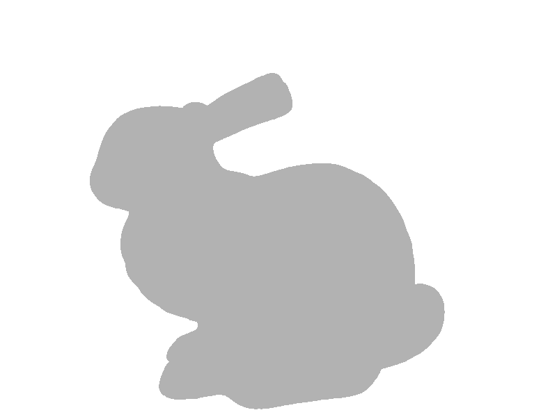
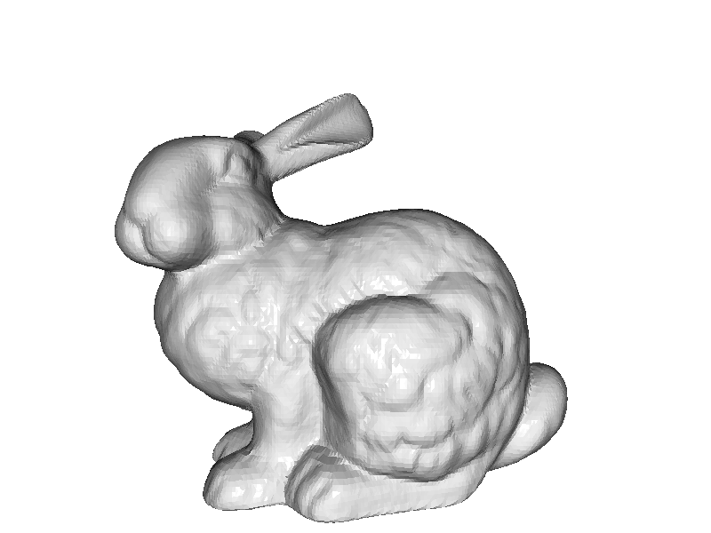

# open3d_toturial
my open3d tutorial

## getting started
```python
# http://www.open3d.org/docs/release/tutorial/geometry/python_interface.html#Getting-started

'''
learn to use built-in help function
'''

import open3d as o3d

pcd = o3d.io.read_point_cloud("data/brain2.ply")
print(pcd)

help(o3d) # prints a description of the open3d module

help(o3d.geometry.PointCloud) # provides a description of the PointCloud class.

help(o3d.io.read_point_cloud) # provides a description of the input arguments and return type of the read_point_cloud function.
```

### point cloud 
read, draw, customized draw, bounding volume

### mesh  
#### read and draw  
```python
    mesh2 = o3d.io.read_triangle_mesh("data/bun_zipper.ply")
    # mesh2.compute_vertex_normals()
    o3d.visualization.draw_geometries([mesh2],width=800,height=600)
```  
  
```python
    mesh2 = o3d.io.read_triangle_mesh("data/bun_zipper.ply")
    mesh2.compute_vertex_normals()
    o3d.visualization.draw_geometries([mesh2],width=800,height=600)
```  
  

### visualization  
```python 
o3d.visualization.draw_geometries()
```
there are 2 types of draw_geometries()
```
    1. draw_geometries(geometry_list, window_name='Open3D', width=1920, height=1080, left=50, top=50, point_show_normal=False, mesh_show_wireframe=False, mesh_show_back_face=False)
        Function to draw a list of geometry.Geometry objects

    Args:
        geometry_list (List[open3d.geometry.Geometry]): List of geometries to be visualized.
        window_name (str, optional, default='Open3D'): The displayed title of the visualization window.
        width (int, optional, default=1920): The width of the visualization window.
        height (int, optional, default=1080): The height of the visualization window.
        left (int, optional, default=50): The left margin of the visualization window.
        top (int, optional, default=50): The top margin of the visualization window.
        point_show_normal (bool, optional, default=False): Visualize point normals if set to true.
        mesh_show_wireframe (bool, optional, default=False): Visualize mesh wireframe if set to true.
        mesh_show_back_face (bool, optional, default=False): Visualize also the back face of the mesh triangles.

    Returns:
        None

    2. draw_geometries(geometry_list, window_name='Open3D', width=1920, height=1080, left=50, top=50, point_show_normal=False, mesh_show_wireframe=False, mesh_show_back_face=False, lookat, up, front, zoom)      
        Function to draw a list of geometry.Geometry objects

    Args:
        geometry_list (List[open3d.geometry.Geometry]): List of geometries to be visualized.
        window_name (str, optional, default='Open3D'): The displayed title of the visualization window.
        width (int, optional, default=1920): The width of the visualization window.
        height (int, optional, default=1080): The height of the visualization window.
        left (int, optional, default=50): The left margin of the visualization window.
        top (int, optional, default=50): The top margin of the visualization window.
        point_show_normal (bool, optional, default=False): Visualize point normals if set to true.
        mesh_show_wireframe (bool, optional, default=False): Visualize mesh wireframe if set to true.
        mesh_show_back_face (bool, optional, default=False): Visualize also the back face of the mesh triangles.
        lookat (numpy.ndarray[float64[3, 1]]): The lookat vector of the camera.
        up (numpy.ndarray[float64[3, 1]]): The up vector of the camera.
        front (numpy.ndarray[float64[3, 1]]): The front vector of the camera.
        zoom (float): The zoom of the camera.

    Returns:
        None
```

